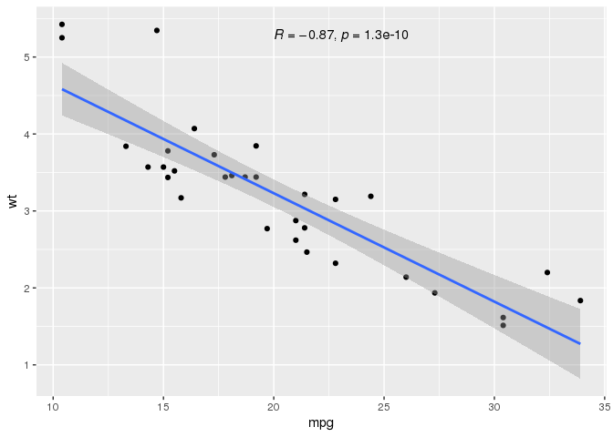
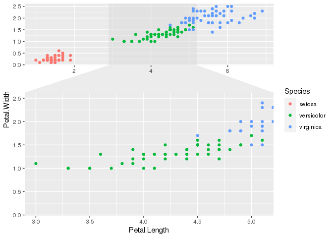
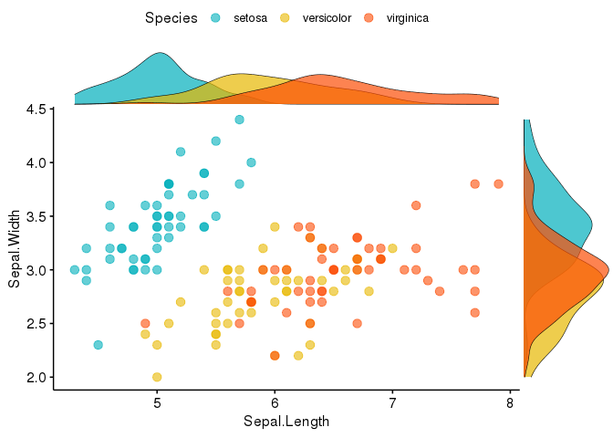

RMarkdown Example
================

## GitHub Documents

This is an R Markdown format used for publishing markdown documents to
GitHub. When you click the **Knit** button all R code chunks are run and
a markdown file (.md) suitable for publishing to GitHub is generated.

## Including Code

You can include R code in the document as follows:

``` r
summary(cars)
```

    ##      speed           dist       
    ##  Min.   : 4.0   Min.   :  2.00  
    ##  1st Qu.:12.0   1st Qu.: 26.00  
    ##  Median :15.0   Median : 36.00  
    ##  Mean   :15.4   Mean   : 42.98  
    ##  3rd Qu.:19.0   3rd Qu.: 56.00  
    ##  Max.   :25.0   Max.   :120.00

## Including Plots

You can also embed plots, for example:

``` r
library("ggpubr")
```

    ## Loading required package: ggplot2

``` r
p <- ggplot(mtcars, aes(mpg, wt)) +
  geom_point() +
  geom_smooth(method = lm) +
  stat_cor(method = "pearson", label.x = 20)
p
```

    ## `geom_smooth()` using formula 'y ~ x'

<!-- -->

``` r
library(ggforce)
ggplot(iris, aes(Petal.Length, Petal.Width, colour = Species)) +
  geom_point() +
  facet_zoom(x = Species == "versicolor")
```

<!-- -->

``` r
library(ggpubr)
# Grouped Scatter plot with marginal density plots
ggscatterhist(
  iris, x = "Sepal.Length", y = "Sepal.Width",
  color = "Species", size = 3, alpha = 0.6,
  palette = c("#00AFBB", "#E7B800", "#FC4E07"),
  margin.params = list(fill = "Species", color = "black", size = 0.2)
)
```

<!-- -->
