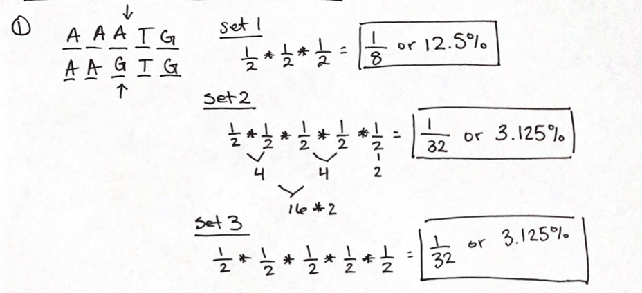
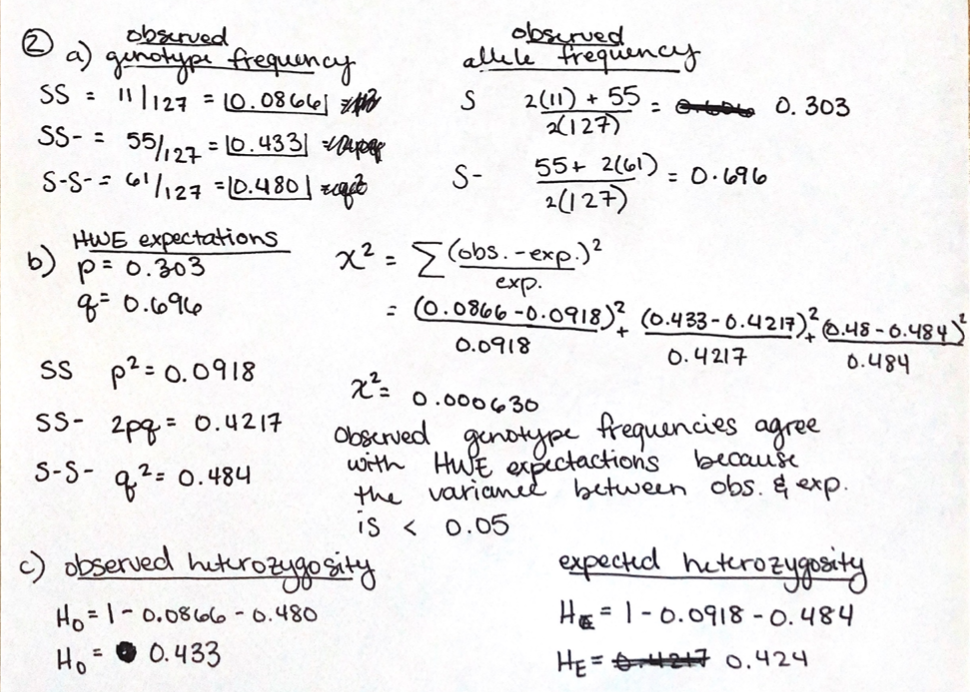
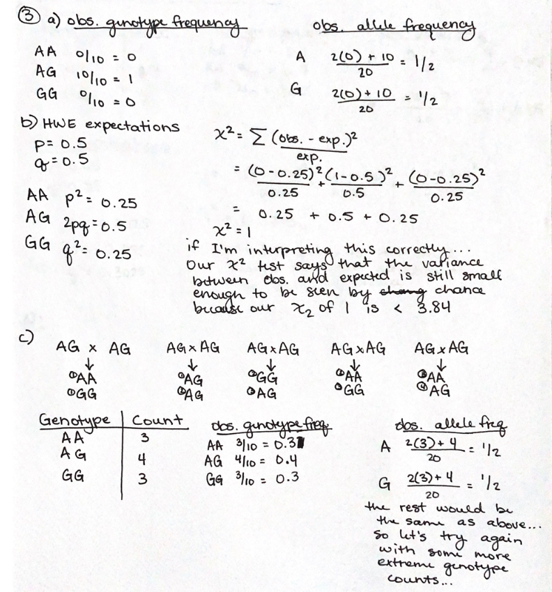
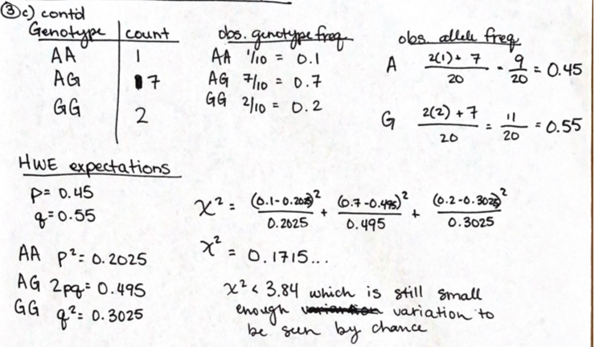
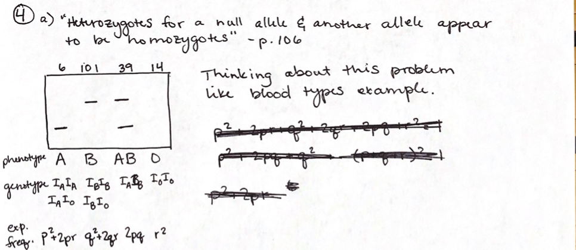

# Problem Set 1
Due 2/15/2023

## Problem 1 
Calculating the probability of the given sequence reads.

## Problem 2
Using the given genotype counts to answer the following:

    A. What are the observed genotype and allele frequencies?
    B. Given the observed allele frequencies, what are the genotypic frequencies expected under Hardy-Weinberg?  Using a chi-square test, how well do the observed genotype frequences agree with the HWE expecations?
    C. What is the observed heterozygosity in this population and what is the expected heterozygosity?

## Problem 3 
Using the given genotype counts to answer the following:

    A. What are the observed genotype and allele frequencies?
    B. Given the observed allele frequencies, what are the genotypic frequencies expected under Hardy-Weinberg?  Using a chi-square test, how well do the observed genotype frequences agree with the HWE expecations?
    C. Simulate one generation of random mating (you don't need to code this simulation; it can be by hand):
        * Pair off the ten indivduals into mating pairs
        * Randomly pick two expected offspring genotypes per pair (10 offspring genotypes)
        * Create a new genotype table from the offsrping only (should only be 10 genotypes)
        * Repeat subqestions A and B on the new genotype table

not sure if I got this one... 

Definitely shaky on determining significance with Chi-squared values... the section in the book was a bit confusing

## Problem 4
This was a doozy!! I started out thinking about this problem like the blood type example given in the book (pg. 106). 

From what I've gathered, I need to assign expected frequencies (i.e. p^2+2pr) to the observed genotype frequencies to figure out the expected allele frequencies of the null allele however that gave me an unfactorable polynomial. So now I feel like I'm on the total wrong path.

