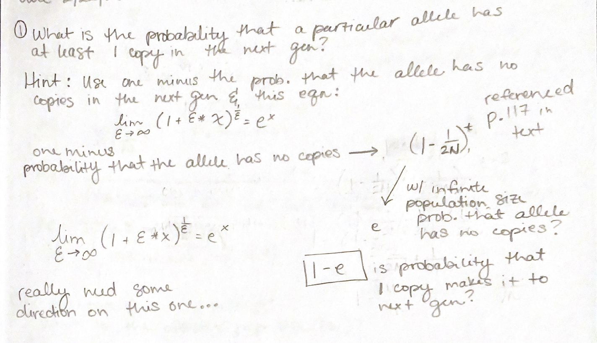
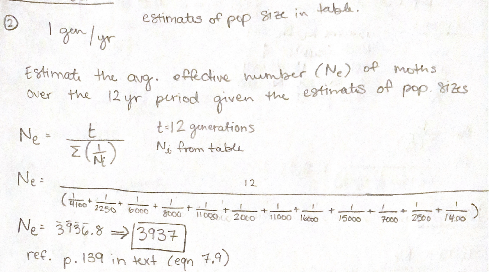
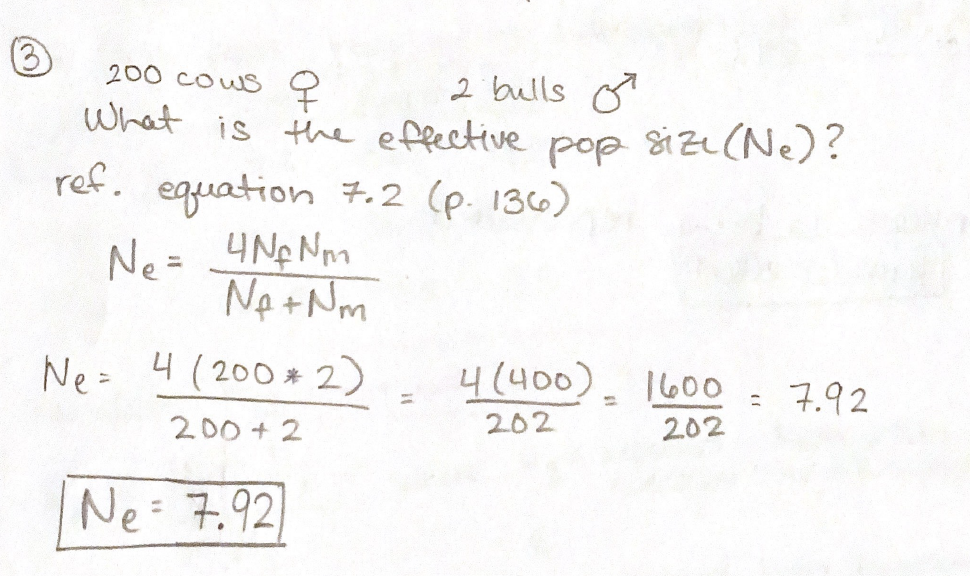
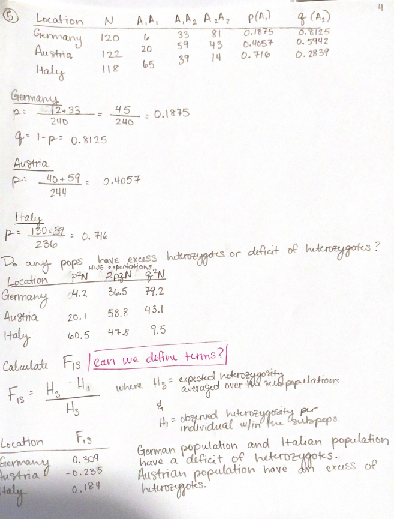

# Problem Set 2
Due 2/22/2023

## Problem 1 
I am very confused on this one...

## Problem 2

## Problem 3

## Problem 4

## Problem 5
| Locality| Obs. A1A1 | Obs. A1A2 | Obs. A2A2|
|---------|--------------|---------|---------|
|Munich| 6|33|81|
|Innsbruck| 20|59|43|
|Verona|65|39|14|

| Locality|p (freq. of A1)| q (freq. of A2)| p2N |2pqN|q2N|
|---------|---------|--------------|--------------|--------------|--------------|
|Munich| 0.1875|0.8125|4.2 |36.5 |79.2 |
|Innsbruck| 0.4057|0.5942|20.1 |58.8 |43.1 |
|Verona| 0.716|0.2839| 60.5| 47.8| 9.5|

| Locality| FIS|
|-----|----|
|Munich| 0.309|
|Innsbruck| -0.235|
|Verona| 0.184|

FIS values indicate:
* Munich and Verona populations have a deficit of heterozygotes
* Innsbruck population seems to have a slight heterozygote excess

Full work shown below: 

