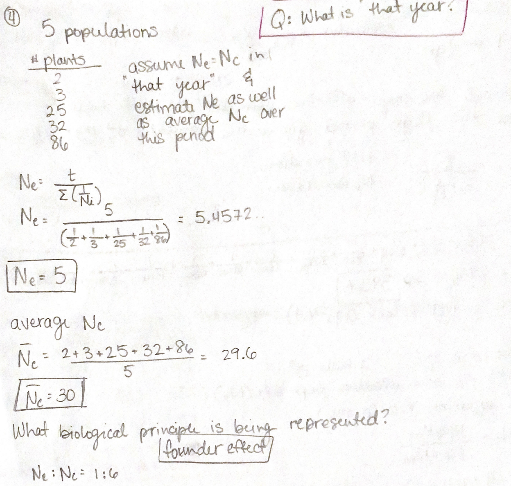

# Problem Set 2
## Due 2/22/2023

### Instructions

* Please answer all questions using a Mardown or RMarkdown, showing all work.
* Please place your files in this same directory in the format of `YourName_Week4_Answers.md`
* Problem sets can be worked on collaboratively, but please note who you worked with in your answer document

## Problems

1.  What is the probability that a particular allele has at least one copy in the next generation?  The surprising answer quickly becomes independent of population size as *N* becomes larger.  (Hint: Use one minus the probability that the allele has no copies in the next generation and this equation: $\lim\limits_{\varepsilon \to \infty}(1+\varepsilon*x)^\frac{1}{\varepsilon} = e^x$)

### Answer
This answer comes from Jacob with some changes from Jon:

> The probability that this allele doesn’t get chosen to reproduce at a
   given timestep is $1- \frac{1}{2N}$. Since each timestep is independent, the
   probability of this happening for a whole generation is $(1- \frac{1}{2N})^{2N}$.

Using the hint from the question, when N is very large $(1- \frac{1}{2N})^{2N}  $

How do we get from that to the hint equation?  What if $x = -1$ and $\varepsilon = \frac{1}{2N}$ ?

$\approx (1- \frac{1}{2N})^{2N} \approx e^{-1} \approx 0.37$ 

2.  A highly isolation colony of the month *Panaxia dominula* near Oxford, England has been instenstively studied by Ford and collaborators over the period of 1928-1968 (Ford and Sheppard 1969).  This speices has one generation per year, and estimates of the population size were caried out yearly begnining in 1941.  For the years 1950-1961, inclusive, estimates of the population size were: 

|Year| Individuals|
|------|----------|
| 1950 | 4100 |
| 1951 | 2250 |
| 1952 | 6000 |
| 1953 | 8000 |
| 1954 | 11000 |
| 1955 | 2000 |
| 1956 | 11000 |
| 1957 | 16000 |
| 1958 | 15000 |
| 1959 | 7000 |
| 1960 | 2500 |
| 1961 | 1400 | 
   * Assuming that the actual size of the population in any year equals the effective population size in that year, estimate the average effective number over the entire 12-year period.

### Answer 
This answer comes from Seraphina:

$$N1+N2+N3+N4+N5+N6+N7+N8+N9+N10+N11+N12=$$
$$4100+2250+6000+8000+11000+2000+11000+16000+15000+7000+2500+1400= 86250$$
$$Ne=\frac{t}{\sum(\frac{1}{Ni})}$$
$$Ne=\frac{12}{(\frac{1}{4100}+\frac{1}{2250}+\frac{1}{6000}+\frac{1}{8000}+\frac{1}{11000}+\frac{1}{2000}+\frac{1}{11000}+\frac{1}{11000}+\frac{1}{16000}+\frac{1}{15000}+\frac{1}{7000}+\frac{1}{2500}+\frac{1}{1400})}=3936$$

**Average effective number over the next 12 years is $$Ne=3936$$** 

3.  A dairy farmer has a herd consisting of 200 cows and 2 bulls.  What is the effective population size?

### Answer
This answer comes from Keegan:

$$N_e = \frac {4N_fN_m}{N_f + N_m}$$
$$N_e = \frac{4 * 200 * 2}{200 + 2} = \frac{1600}{202}=7.92$$

4.  A rare triggerplant from Australia (*Stylidium coroniforme*) has only five known populations (Coates 1992).  One of these populations has been monitored for several years, and over five years in the early 1980s: 2, 3, 25, 32, and 86 plants were recoreded.  Assuming *Ne* = *Nc* in that year, estimate *Ne* as well as the average *Nc* over this period.  What biological principle is illustrated by this example?

### Answer
This is from Megan:

**From Jon** The bottleneck in the first two years disproportionately decreased *Ne* and would thus increase drift greatly.

5.  You genotype a species of grasshopper along a transect in the European Alsp.  Near Munich, Germany, you sample 120 individuals; near Inssbruck, Austria, you sample 122 individuals;  near Verona, Italy you sample 118 individuals.  You find the following genotypes:

| Locality| A1A1 | A1A2 | A2A2|
|---------|--------------|---------|---------|
|Munich| 6|33|81|
|Innsbruck| 20|59|43|
|Verona|65|39|14|

* Calculate the frequencies of the two alleles in each population
* Do any populations have excess heterozygotes?
* Do any populations have a deficit of heterozygotes?
* Calculate *FIS* for each of the populations and how does this related to B and C?
   * Hint: this the equation $F_{IS} = \frac{H_S - H_I}{H_S}$
   * I suggest looking it up, but you can likely figure it out from context

### Answer
This is from Zoe:

* **Calculate the frequencies of the two alleles in each population**

   - Genotype Frequencies:

| Locality | FreqA1A1 | FreqA1A2 | FreqA2A2|
|----------|--------------|---------|---------|
| Munich   | 6/120  | 33/120 | 81/120 |
| Innsbruck| 20/122 | 59/122 | 43/122 |
| Verona   | 65/118 | 39/118 | 14/118 |

| Locality | FreqA1A1 | FreqA1A2 | FreqA2A2|
|----------|-----------|---------|---------|
| Munich   | 0.050     | 0.275     | 0.675     |
| Innsbruck| 0.164     | 0.484     | 0.352     |
| Verona   | 0.551     | 0.331     | 0.119     |

   - Allele Frequencies:

| Locality | FreqA1 | FreqA2 |
|----------|-----------|---------|
| Munich   | $p = \frac{2*N_{A_1A_1} + N_{A_1A_2}}{2N}$     | $q = \frac{2*N_{A_2A_2} + N_{A_1A_2}}{2N}$     |
| Innsbruck| $p = \frac{2*N_{A_1A_1} + N_{A_1A_2}}{2N}$     | $q = \frac{2*N_{A_2A_2} + N_{A_1A_2}}{2N}$     |
| Verona   | $p = \frac{2*N_{A_1A_1} + N_{A_1A_2}}{2N}$     | $q = \frac{2*N_{A_2A_2} + N_{A_1A_2}}{2N}$     |

| Locality | FreqA1 | FreqA2 |
|----------|-----------|---------|
| Munich   | $p = \frac{2* 6 + 33}{2* 120}$     | $q = \frac{2* 81 + 33}{2* 120}$     |
| Innsbruck| $p = \frac{2* 20 + 59}{2* 122}$    | $q = \frac{2* 43 + 59}{2* 122}$     |
| Verona   | $p = \frac{2* 65 + 39}{2* 118}$    | $q = \frac{2* 14 + 39}{2* 118}$     |

| Locality | FreqA1 | FreqA2 |
|----------|-----------|---------|
| Munich   | $p = \frac{12 + 33}{240}$     | $q = \frac{162 + 33}{240}$     |
| Innsbruck| $p = \frac{40 + 59}{244}$    | $q = \frac{86 + 59}{244}$     |
| Verona   | $p = \frac{130 + 39}{236}$    | $q = \frac{28 + 39}{236}$     |

| Locality  | FreqA1 | FreqA2 |
|-----------|------------------|------------------------|
| Munich    | 0.1875           | 0.8125                 |
| Innsbruck | 0.4057           | 0.5943                 |
| Verona    | 0.7161           | 0.2839                 |

* **Do any populations have excess heterozygotes?**

   - HW equilibrium states that the expected genotype frequencies given the allele frequencies p and q is as follows:
      - $(p + q)^2 = p^2 + 2pq + q^2$, where $N_{eA_1A_1} = p^2$, $N_{eA_1A_2} = 2pq$, and $N_{eA_2A_2} q^2$

| Locality | FreqA1A1 | FreqA1A2 | FreqA2A2|
|----------|-----------|---------|---------|
| Munich   | $p^2 = 0.1875^2$    | $2pq = 2* 0.1875*0.8125 $    | $q^2 = 0.8125^2$    |
| Innsbruck| $p^2 = 0.4057^2 $   | $2pq = 2* 0.4057*0.5943 $    | $q^2 = 0.5943^2 $     |
| Verona   | $p^2 = 0.7161^2 $   | $2pq = 2* 0.7161*0.2839 $     | $q^2 = 0.2839^2$    |

Calculated Expected Genotype frequency:

| Locality  | FreqA1A1 | FreqA1A2 | FreqA2A2 |
|-----------|-----------|---------|---------|
| Munich    | 0.035   | 0.305 | 0.660 |
| Innsbruck | 0.165  | 0.482 | 0.353 |
| Verona    | 0.513   | 0.407 | 0.081 |

| Locality  | FreqA1A1 | FreqA1A2 | FreqA2A2 |
|-----------|-----------|---------|---------|
| Munich    | 0.035* 120 =  4   | 0.305* 120 =  37 | 0.660*120 =  79 |
| Innsbruck | 0.165* 122 =  20  | 0.482* 122 =  59 | 0.353*122 =  43 |
| Verona    | 0.513* 118 =  60   | 0.407* 118 =  48 | 0.081*118 =  10 |

Observed Genotype Frequency:

| Locality| A1A1 | A1A2 | A2A2|
|---------|--------------|---------|---------|
|Munich| 6|33|81|
|Innsbruck| 20|59|43|
|Verona|65|39|14|

   Heterozygotes Chi-Squared.... (since $F_{IS}$ has not been brought up yet)

   - Chi Squared: Sum of (O-E)^2 / E

| Locality  | Chi Squared    | FreqA1A2 |
|-----------|----------------|---------|
| Munich    | (O-E)^2 / E    | $\frac{(33 - 37 )^2}{37} = 0.347$   |
| Innsbruck | (O-E)^2 / E    | $\frac{(59 - 59)^2}{59} = 0.0004899$   |
| Verona    | (O-E)^2 / E    | $\frac{(39 - 48)^2}{48} = 1.680$   |

* **Do any populations have excess heterozygotes?**

   - No? Munich and Verona have less heterozygotes than expected and Innusbruck had the same.

* **Do any populations have a deficit of heterozygotes?**

   - Verona? Munich has *slightly* less heterozygotes than expected and Innusbruck had the same.

* **Calculate *FIS* for each of the populations and how does this related to B and C?**

Equation 9.2: $F_{IS} = 1- \frac{H_O}{H_S}$

| Locality  | *FIS*                     |
|-----------|------------------------------------------------------|
| Munich    | $F_{IS} = 1- \frac{H_O}{H_S} = 1- \frac{0.275}{0.305} $   |
| Innsbruck | $F_{IS} = 1- \frac{H_O}{H_S} = 1- \frac{0.484}{0.482} $   |
| Verona    | $F_{IS} = 1- \frac{H_O}{H_S} = 1- \frac{0.331}{0.407} $   |

| Locality  | *FIS*                     |
|-----------|------------------------------------------------------|
| Munich    | $F_{IS} = 1- \frac{0.275}{0.305} = 1 - 0.9016 = 0.0984 $   |
| Innsbruck | $F_{IS} = 1- \frac{0.484}{0.482} = 1 - 1.004  = -0.004 $   |
| Verona    | $F_{IS} = 1- \frac{0.331}{0.407} = 1 - 0.8133 = 0.1867 $   |

A negative value for Innsbruck indicates heterozygote excess, though this is very close to zero.

Both Verona and Munich have positive *FIS* values, inicating a heterozygote deficit, and that of Verona is almost two-fold the *FIS* of Munich.
